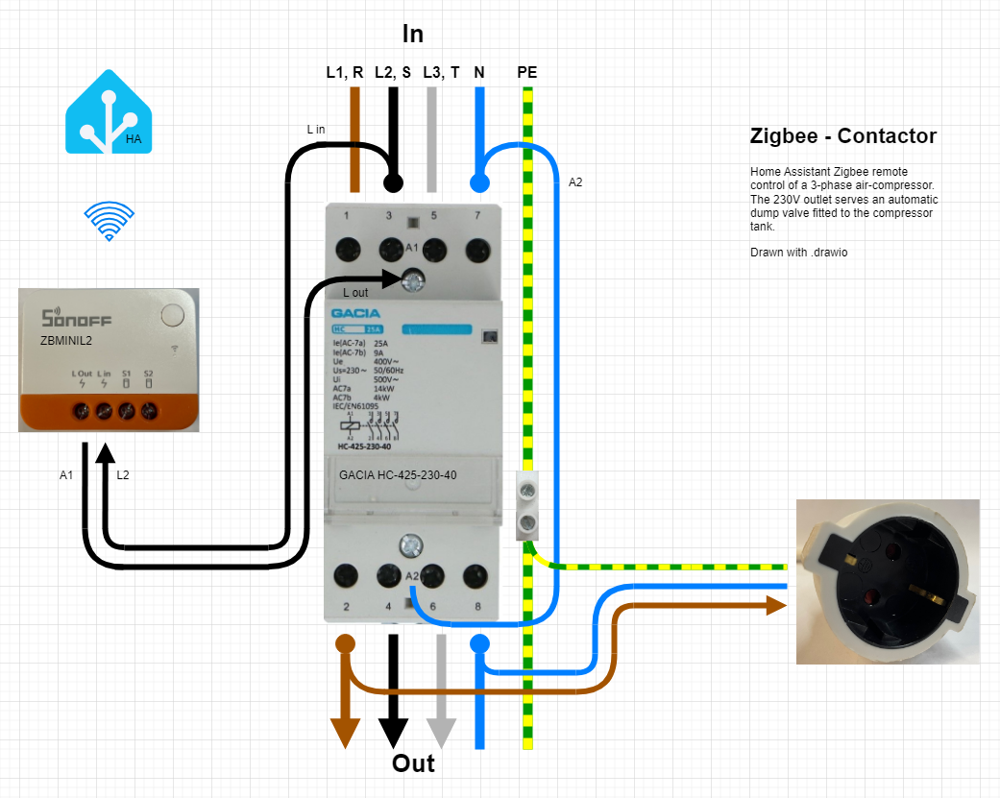

Zigbee contactor wiring for Home Assistant within EU.
This setup let´s me control when the compressor should be ON/OFF via HA.
The kontaktor feeds a 3-phase air-compressor 
and a 230V single phase automatic dump-valve, letting out condensed water 10 sec every 60 mins.

